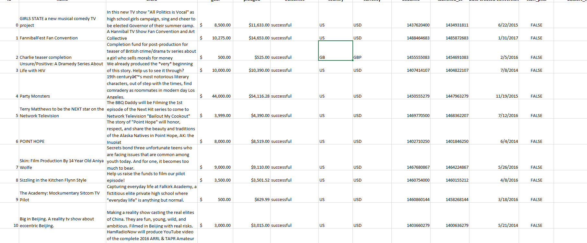

# Fundraising Analysis
## Overview of Project
overview of the project is a challenge, an exercise of Excel prowess by creating two new analyses: outcomes based on goals and products based on launch date. Louise is an upcoming playwriter who wants to start a crowdfunding campaign to help fund her play "Fever" for which she is estimating a budget of $10,000. She wants our help to determine whether there are specific factors that make project campaigns successful. We will be analyzing and sorting crowdfunding data to determine the same.

### Purpose
the purpose was for Louise’s play Fever to come close to its fundraising goal in a short amount of time. Now, she wants to know how different campaigns fared about their launch dates and their funding goals. Using the Kickstarter dataset that you’ve already combed through, you’ll visualize campaign outcomes based on their launch dates and their funding goals. We need to provide visualized feedback to Louise with insights to help her gain a better understanding of the campaign from start to finish so that she will be able to set her campaign to mirror other successful ones in the same category.

## Analysis and Challenges

### Analysis of Outcomes Based on Launch Date

The char most successful campaigns are organized in May
### Analysis of Outcomes Based on Goals

### Challenges and Difficulties Encountered

## Results
- What are two conclusions you can draw about the Outcomes based on the Launch Date?
it's the success of may

- What can you conclude about the Outcomes based on Goals?
Outcome goals focus on the endpoint of success and failure.

- What are some limitations of this dataset?
 Limitations of a dataset

- What other possible tables and/or graphs could we create?
An interactive dashboard 

